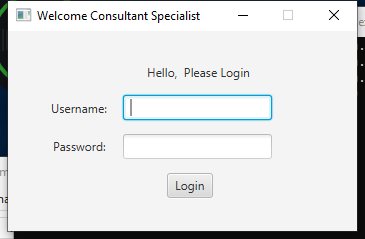

# TimAguirreCustomerScheduler

A desktop scheduling application for managing customer appointments, built for a university programming course. The app supports multiple time zones and has been localized for Spanish (Mexico).

*The app launches on this login screen; the appointment dashboard beyond it requires a live MySQL connection.*

## Features
- Add, update, and delete customer appointments
- View appointments by week or month
- Time zone-aware scheduling (auto-converts to/from UTC)
- Localization support: English and Spanish (Mexico — `es_MX`)
- Lambda expressions used for:
  - `lambdaFifteenMinAlert()` — alerts user of appointments within 15 minutes of login
  - `lambdaGetAllDatesInRange()` — filters appointments within a date range
- Input validation and error messaging

## Tech Stack
- **Language**: Java
- **UI**: JavaFX / FXML
- **Database**: MySQL (via JDBC)
- **IDE**: IntelliJ IDEA

## Getting Started
1. Set up a MySQL database and update `DBConnection.java` with your credentials
2. Open the project in IntelliJ
3. Build and run `Main.java`
